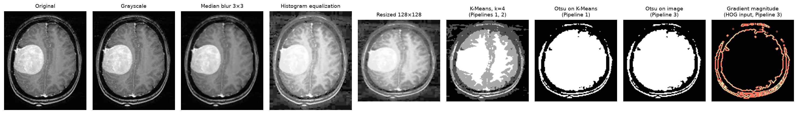
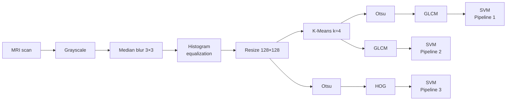
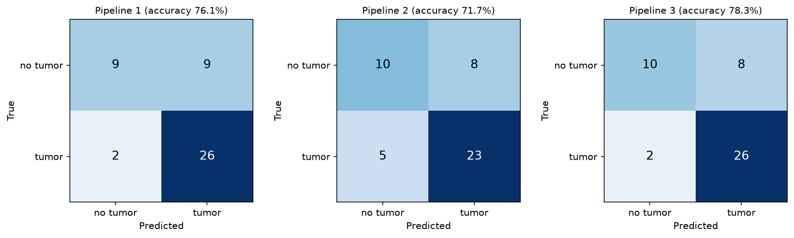

# Brain Tumor Detection in MRI Scans with Classical Image Processing

Binary classification of brain MRI scans (tumor / no tumor) with a hand-built
image-processing pipeline: denoising, contrast enhancement, K-Means and Otsu
segmentation, GLCM and HOG feature extraction, and an SVM classifier.

The project reimplements the method of Varshney et al., *"Image Processing based
Brain Tumor Detection"* (IEEE ICFIRTP 2022, [doi:10.1109/ICFIRTP56122.2022.10059426](https://doi.org/10.1109/ICFIRTP56122.2022.10059426)).
It then tests two variants that address weaknesses found in the original design. Every image-processing algorithm is
implemented from scratch with NumPy. OpenCV is used only to read and resize
images, and scikit-learn only for the SVM and the evaluation.



## Pipelines



| | Segmentation | Features | Motivation |
|---|---|---|---|
| **Pipeline 1** | K-Means → Otsu | GLCM, 7 features | The paper's method. Otsu reduces the 4-level K-Means image to a binary mask, so GLCM sees almost no texture. |
| **Pipeline 2** | K-Means | GLCM, 7 features | Drops the redundant Otsu step so GLCM is computed on the 4-level image. |
| **Pipeline 3** | Otsu | HOG, 8100 features | Describes the shape and edges of the segmented brain instead of its texture. |

**GLCM features:** intensity mean and standard deviation, plus contrast, entropy,
energy, homogeneity and correlation of the gray-level co-occurrence matrix,
averaged over 0°, 45°, 90° and 135°.
**HOG:** [-1, 0, 1] gradients, 9 orientation bins over 0–180°, 8×8-pixel cells
and L2-normalised 2×2-cell blocks.
**Classifier:** standardisation followed by an RBF-kernel SVM. `C`, `gamma` and
`class_weight` are tuned by 5-fold stratified grid search.

## Results

228 unique scans (87 no tumor, 141 tumor). Two evaluation protocols:

* **Hold-out:** hyperparameters tuned on a stratified 80 % split, evaluated once on the remaining 20 % (46 scans).
* **Nested cross-validation:** 5-fold stratified CV repeated 10 times (50 outer folds), with the grid search run inside every training fold. The test set is small, so a single split is noisy (one scan is about 2 percentage points). This is the more reliable estimate.

| Pipeline | Steps | Train acc. | Hold-out test acc. | Hold-out F1 (macro) | **Nested CV acc.** (mean ± std) |
|---|---|---|---|---|---|
| Pipeline 1 | K-Means → Otsu → GLCM | 76.4% | 76.1% | 0.723 | **73.1% ± 5.1%** |
| Pipeline 2 | K-Means → GLCM | 83.0% | 71.7% | 0.693 | **68.8% ± 5.8%** |
| Pipeline 3 | Otsu → HOG | 96.7% | 78.3% | 0.753 | **80.5% ± 4.8%** |



**Findings**

* **Shape features beat texture features.** Pipeline 3 (HOG on the Otsu mask) is
  the most accurate, about 7 points above the paper's method in nested CV.
  Its gap between train and test accuracy shows the cost of learning 8100
  features from about 180 training images.
* **Removing Otsu does not help GLCM.** Pipeline 2 overfits more than
  Pipeline 1 (83% train vs 69% CV). The 4-level K-Means image gives GLCM more
  detail, but much of that detail is noise that does not separate the classes.
* **Missed healthy scans are the main error.** All pipelines detect tumors well
  (recall 0.82–0.93) but misclassify many healthy scans. Even with class
  weighting tried during tuning, the classes stay imbalanced (62% tumor).
* **Duplicates inflate the scores.** When the 25 duplicate files are kept,
  nested-CV accuracy rises by 1.5–2.4 points for every pipeline (74.5%, 70.6%
  and 82.9%), because copies of training images also appear in the test folds.

All numbers come from `python run_experiments.py`. The full metrics are in
[`results/metrics.json`](results/metrics.json).

### Implementation notes

* **Vectorised from-scratch algorithms.** The median filter, histogram
  equalization, Otsu threshold, GLCM and HOG gradients are unit-tested against
  OpenCV or a loop-based reference ([`tests/`](tests)). Feature extraction for
  all 228 images takes seconds.
* **Deterministic K-Means.** Centroids start evenly spaced over the intensity
  range, so no two start identical even with a large black background. Clusters
  are sorted by intensity, so label 0 is always the background in every image.
* **No information leaks into the test data.** Duplicates are removed before
  splitting, and the scaler is fitted inside each cross-validation fold as part
  of the model.
* **Reproducible.** Files are read in sorted order and every random split uses a fixed seed.

## Repository structure

```
├── src/brain_tumor/
│   ├── data.py             dataset loading and duplicate removal
│   ├── preprocessing.py    grayscale, median filter, histogram equalization, resize
│   ├── segmentation.py     K-Means clustering, Otsu thresholding
│   ├── features.py         GLCM and HOG
│   ├── pipelines.py        the three feature pipelines
│   ├── classification.py   SVM, grid search, hold-out and nested cross-validation
│   └── visualization.py    figures
├── notebooks/walkthrough.ipynb   step-by-step walkthrough with all figures
├── run_experiments.py      reproduces every number and figure in this README
├── results/                metrics.json, results.md, figures/
├── tests/                  unit tests (checked against OpenCV and loop-based references)
└── data/README.md          how to download the dataset
```

## How to run

```bash
git clone https://github.com/ADITYA-WORK-MAITI/brain-tumor-mri-classification.git
cd brain-tumor-mri-classification
python -m venv .venv
source .venv/bin/activate        # Windows: .venv\Scripts\activate
pip install -r requirements.txt
pip install -e .
```

Download the dataset as described in [`data/README.md`](data/README.md), then run:

```bash
python run_experiments.py        # all three pipelines, writes results/
pytest                           # unit tests
jupyter notebook notebooks/walkthrough.ipynb
```

The full run takes about 30 minutes on a laptop CPU, almost all of it nested
cross-validation of the 8100-dimensional HOG features.
`python run_experiments.py --cv-repeats 0` runs the hold-out evaluation only
and finishes in about a minute.

## Dataset

[Brain MRI Images for Brain Tumor Detection](https://www.kaggle.com/datasets/navoneel/brain-mri-images-for-brain-tumor-detection)
(N. Chakrabarty, Kaggle) contains 253 MRI scans: 155 with a tumor and 98 without.
25 files duplicate another image, so the experiments use the 228 unique scans.
See [`data/README.md`](data/README.md).

## Limitations

* The dataset is small and comes from a single public source. The results show
  how the methods compare with each other. They are not evidence of clinical
  performance.
* K-Means groups pixels by intensity only, so its four clusters do not correspond
  exactly to gray matter, white matter, CSF and tumor.
* HOG on a global Otsu mask describes the overall shape of the brain and the
  bright regions inside it. It does not localise the tumor.

## References

1. S. Varshney, S. K. Prajapati, S. Rajput, M. Kaur, N. Rakesh and M. K. Goyal,
   "Image Processing based Brain Tumor Detection," *2022 International Conference
   on Fourth Industrial Revolution Based Technology and Practices (ICFIRTP)*,
   Uttarakhand, India, 2022, pp. 204–209.
   [doi:10.1109/ICFIRTP56122.2022.10059426](https://doi.org/10.1109/ICFIRTP56122.2022.10059426)
2. N. Chakrabarty, "Brain MRI Images for Brain Tumor Detection," Kaggle dataset.
   <https://www.kaggle.com/datasets/navoneel/brain-mri-images-for-brain-tumor-detection>

## Authors

Aditya Maiti and Himanshu Singh. Computer vision course project: reimplementation
of a research paper.

## License

[MIT](LICENSE)
